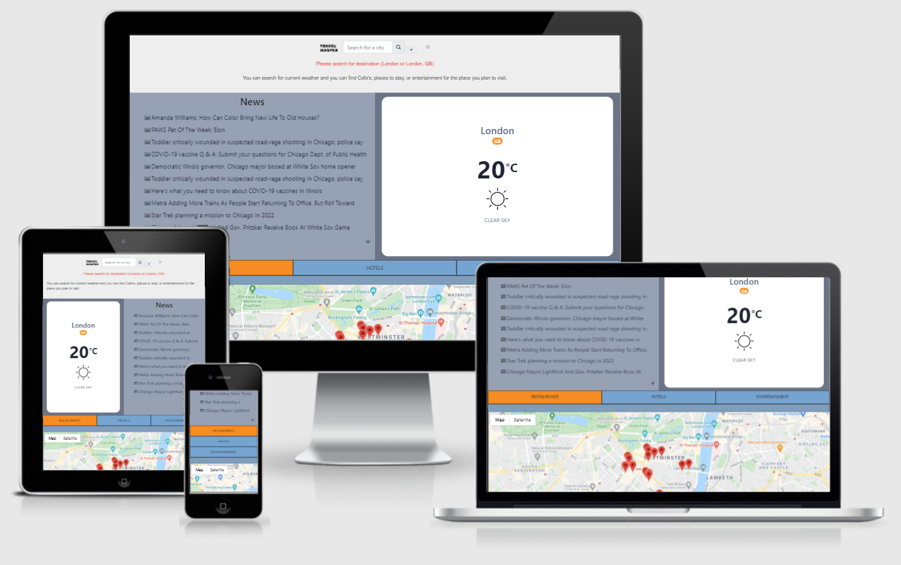

# Milestone 2 project  
  
## [Live website on github pages](https://alexandergrib.github.io/ms2/)  
  

---

# Table of contents  

- [UX](#ux)
  * [Website owner business goals](#website-owner-business-goals)
  * [User goals](#user-goals)
- [Structure of the website](#structure-of-the-website)
    + [Medium size / tablet](#medium-size---tablet)
    + [Mobile screen](#mobile-screen)
- [Wireframes](#wireframes)
  - [Desktop / Tablet](#-desktop---tablet--wireframes-mobilepng-)
  - [Mobile](#-mobile--wireframes-mobilepng-)
- [Surface](#surface)
  * [Fonts](#fonts)
  * [Colors](#colors)
  * [Images](#images)
  * [Text](#text)
- [Features](#features)
  * [Existing Features](#existing-features)
    + [Home (index.html):](#home--indexhtml--)
    + [Footer](#footer-)
- [Technologies used:](#technologies-used-)
- [Testing](#testing)
- [Site logic](#site-logic)
- [Deployment](#deployment)
- [Problems encountered:](#problems-encountered-)
- [Credits](#credits)
  * [Credits for text and modules](#credits-for-text-and-modules)
  * [Credits for images used](#credits-for-images-used)

# UX  
  
## Website owner business goals  
-	My website is aimed to target traveling visitors, to provide them "all in one" source of information they can check before visiting their destination.
-	My goal is to provide information about current weather in selected city.
-	My goal is to provide information about relative news for selected city by displaying news headlines
-	My goal is to provide information about entertainment places, places to stay and things to do around selected location
-	Website user should have possibility to switch between restaurants, things to do and stay(hotels) after results are displayed
-	Website user should have possibility to switch between Centigrade and Fahrenheit for their convenience 
-	Website user should be able to click on the pins displayed on map to get more info about their plaice of interest

## User goals  
-	As a user I want to be able to search for the required destination and be able to get relevant information 
-	As a user I want to have possibility of my location to be identified automatically  
-	As a user I want to be able to choose in which units to display information metric or imperial  
-	As a user I want to be able to see current weather in specified destination
-	As a user I want to be able to see news in the selected destination  
-	As a user I want to be able to see places to visit in the selected destination  
-	As a user I want to be able to see places to stay in the selected destination  
-	As a user I want to be able to see places to eat in the selected destination
-	As a user I want to be able to open a link to webpage of the place provided
  
  
 

  
  

# Structure of the website  

The website consists one page with the search field and search button. And have brief instructions what is this website about and how to use it.  On the first-time visiting website, user will be offered to automatically detect their location, or manually enter their city.
Once current city is identified automatically or entered manually, brief description will disappear, and searched Information will  be placed instead.
User will be offered to select which units to display by clicking on either “C” or “F” button, located next to the search button. By default, “C” option will be active. To clearly display which one is active now, “C” or “F” will show in different font size, active will have 50% bigger font size.

Main page is split into 4 different sections
1.	News section utilize news API to display current countrywide general news for the searched place.
2.	Weather section is divided into 2 subsections. 
    -	Main section will display today weather forecast with today date, current temperature, and icon for the current weather(clouds, sun, rain, etc.)
    -	Second section will display minimalistic forecast for the next 3 days, and will include date, temperature, and weather icon.
3.	“Things to do” section located under first two and occupying full screen width, will consist with cards displaying relevant search information for the desired destination.
    -	On the top of this section will also display selectors where user can choose between (Things to do, Places to eat, Places to stay), after selection made card will be updated with relevant information based on user selection.
    -	Each card will be linked to relevant webpage for the place found, allowing user to explore place in interest. Page will open in the new page.
4.	Last Section is a map with pins displayed based on selection made in section 3(things to do). 

Bottom of the page will contain footer with contact site owner information and icons for GitHub repository.
  

In case of any of the API get failed, error message will be displayed and default information will be loaded.

##Adaptivity
Website will adapt to screen size by rearranging sections and adjusting their width to fit into smaller screen.

### Medium size / tablet
On medium screen size webpage will keep its layouts as on the larger screen but will get downsized to fit into user screen size.

### Mobile screen
On mobile devices and other small screens each section will occupy full width of the screen and will be moved one under another.  

# Wireframes  
Wireframes can be found here:
##### [Desktop / Tablet](wirefames/wireframes/Desktop.png)
##### [Mobile](wirefames/wireframes/Mobile.png)
  ---
# Surface  
## Fonts  
I decided to go with Google Roboto font and sans-serif as a fallback font.  
I think Roboto font is a most used font across whole internet, and it would not look too different for the user coming from any website they used to use.  This will create a more familiar feeling for the users.
## Colors  
I used following colours:  
- Body background color: #C6E7C6  
- jumbotron color: #215020
- Headings color: #474545
- Text color: #474545  
- Background color header and footer: #93C47D
    
## Images    
## Text  

# Features    
## Existing Features    
### Home (index.html):  
-	Search field with search button
-	Search field should contain typeahead functionality.
-	Pop up message asking user to allow to use user device location
-	Information section how to use this website and what it offers to the user
-	Once search is made, Informational section will disappear and new 4 sections will be displayed
-	News section occupying left side 30% of the screen
-	Weather section located next to the news section and occupying 60% of the screen
-	“Things to do” section occupying 90% of the width located below weather and news section
-	After “things to do”, map section with location pins displayed on the map. Location for the pins taken from “things to do” section and should be updated on user choice of selection in “things to do” section.
### Footer
-	 Footer containing website owner information

 
# Technologies used:  
*	HTML   
*	Javascript
*   Jquery
*	Bootstrap  
*	Fontawesome  
*	Google API    
*	Github  
*	Git  
*	Balsamiq  
*   RapidApi
*	[Trello](https://trello.com/b/fu6IEy31/ms2-prject) for KANBAN project organizing
*	CSS  
  
# Testing
Testing.md  

# Site logic
logic.md

# Deployment  
- Deployment made via GitHub pages.  Fork my repository, then go to Setting on forked repository scroll down to GitHub Pages and select in Source section the branch to be used.  
  
# Problems encountered: 
- After searching for place map not center itself to that location
  - Fixed by setting new boundaries instead of extending previous (bounds = new google.maps.LatLngBounds();) 

- News API free version works only on localhost, to use it online i have to upgrade to paid account.
    - switched API to Rapidapi.com. Tried to use Google search news, but response time was 3-4 seconds, this caused significant delay after page loaded and populating news feed.
    - Switched to Newscatcher API from Rapidapi.com this helped to decrease response time down to 200-300ms.

- Console error (Failed to load resource: the server responded with a status of 403 ())
    - error coming from google API (need to investigate more what is causing it)
    
- Sometimes warning in console show-up about security for API
    - error disappear on the page refresh

# Credits  
- Full credits for the game to [Frank's Laboratory](https://www.youtube.com/channel/UCEqc149iR-ALYkGM6TG-7vQ)

## Credits for text and modules
- [Weather api](https://webdesign.tutsplus.com/tutorials/build-a-simple-weather-app-with-vanilla-javascript--cms-33893)
- [typeahead](//http://twitter.github.io/typeahead.js/examples/)
- [world cities database](https://simplemaps.com/data/world-cities)
- [map](https://developers.google.com/maps/documentation/javascript/examples/place-search-pagination#maps_place_search_pagination-css)

## Credits for images used
 - [Favicon creator tool](https://realfavicongenerator.net/)

